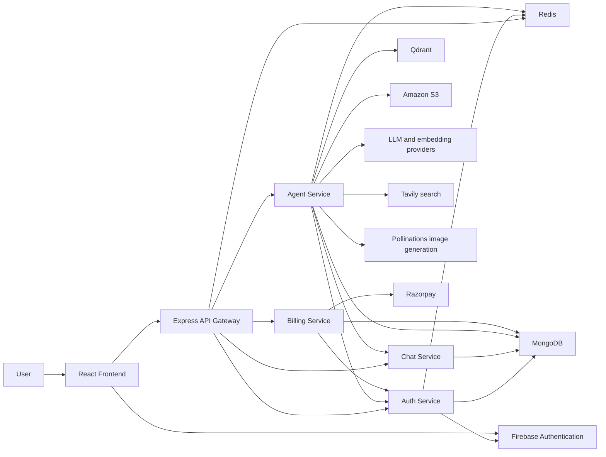

# AI Multi-Agent Knowledge Assistant

## Overview

AI Multi-Agent Knowledge Assistant is a full-stack application for conversational AI, coding assistance, web search, and working with documents and images. A React frontend sends requests through an Express API gateway to separate authentication, chat, agent, and billing services. The Agent Service uses LangGraph to route requests to specialized workflows and integrates with Redis, MongoDB, Qdrant, object storage, and external AI/search providers.

## Key Features

- **Multi-agent workflow:** A LangGraph workflow routes each request to a specialist or accepts an explicitly selected agent.
- **Conversational chat:** Conversations and messages are managed by the Chat Service; Redis caches recent conversation history for the chat agent.
- **Coding assistance:** The coding agent handles code generation, review, explanation, debugging, optimization, conversion, and documentation requests.
- **Web search:** The search agent uses Tavily and passes its results to the chat agent to produce a response.
- **PDF knowledge retrieval:** Uploaded PDFs are text-extracted, split into overlapping chunks, embedded, stored in Qdrant, and searched for relevant context before answering.
- **PDF and presentation generation:** The Agent Service creates PDF documents and PowerPoint presentations from generated content.
- **Image workflows:** Users can submit images for analysis or request image generation.
- **Authentication and sessions:** Google sign-in is verified by Firebase Admin; application sessions are stored in Redis and represented by an HTTP-only cookie.
- **Billing and credits:** The Billing Service creates and verifies Razorpay payments; verified plans update user credits through the Auth Service.
- **File storage:** Generated files and images are uploaded to Amazon S3 and returned using signed download links.
- **Rate limits:** Agent usage limits are tracked in Redis.

## Architecture

The React application communicates with the API Gateway. The Gateway proxies requests to the Auth, Chat, Agent, and Billing services. Some backend services also communicate directly: the Agent Service saves and retrieves chat messages through Chat and requests credit deductions through Auth; Billing asks Auth to apply verified plan credits.

| Component | Responsibility |
| --- | --- |
| React frontend | Chat interface, conversation navigation, authentication UI, agent requests, generated artifacts, and billing UI. |
| API Gateway | Applies CORS and session middleware, exposes the frontend-facing API routes, and proxies requests to backend services. |
| Auth Service | Verifies Firebase ID tokens, manages user records and Redis-backed sessions, and handles credit/plan updates. |
| Chat Service | Stores and retrieves conversation and message records in MongoDB. |
| Agent Service | Routes AI requests, coordinates specialist agents, uses Redis for memory and limits, and integrates with document, image, storage, and AI services. |
| Billing Service | Creates Razorpay orders, verifies payment signatures, stores payment records, and requests plan updates from Auth. |
| Redis | Stores sessions, cached chat memory, and per-agent rate-limit counters. |
| MongoDB | Persists user, conversation, message, and payment data through Mongoose models. |
| Qdrant | Stores document vectors for PDF retrieval. |
| Amazon S3 | Stores generated documents and images through the AWS SDK; the Agent Service returns signed downloads. |
| External AI/search services | LangChain integrations provide Groq, Google Gemini, OpenRouter, and Tavily capabilities. Image generation also requests an image from Pollinations. |

### Architecture diagram



## AI Agent Architecture

The Agent Service exposes `POST /chat`. It accepts a prompt, conversation information, an optional selected agent, and an optional uploaded file. The LangGraph state contains request data and fields for the selected agent, response, search results, images, artifacts, user, and file.

The router behaves as follows:

1. If a non-`auto` agent is selected, it routes to that agent.
2. If a PDF or image is uploaded, it routes to PDF RAG or image analysis respectively.
3. Otherwise, an LLM classifies the prompt as chat, search, coding, PDF generation, presentation generation, or image generation.
4. The selected workflow runs. Search results continue to the chat agent, which answers using those results; other agents return their result directly.

| Agent | Verified responsibility |
| --- | --- |
| Chat | Produces conversational responses using recent conversation history. |
| Search | Runs a Tavily search; its results are passed to Chat to formulate the final answer. |
| Coding | Classifies coding intent and generates project files or returns a Markdown explanation/review/debugging response. |
| PDF | Generates structured document content and renders it as a PDF. |
| PDF RAG | Extracts text from an uploaded PDF and answers questions using retrieved PDF context. |
| PPT | Generates structured slide content and renders a PowerPoint presentation. |
| Vision | Turns a user request into an image prompt, requests an image, and stores it. |
| Image Analyzer | Analyzes an uploaded image and responds to the user's question. |

Agent rate limits and credit deductions are handled through Redis and the Auth Service. The Agent Service sends chat messages to the Chat Service and uses that service to load conversation history when it is not cached.

## RAG and Knowledge Processing

The PDF RAG workflow is implemented in the Agent Service:

1. The upload middleware accepts PDF files and images up to 20 MB.
2. For PDFs, `pdf-parse` extracts text from the uploaded file.
3. LangChain's recursive text splitter creates chunks with a configured size of 1,000 characters and overlap of 200 characters.
4. Google Generative AI embeddings are generated for the document chunks.
5. The chunks and embeddings are stored in a Qdrant collection created for the uploaded PDF.
6. A similarity search retrieves up to five relevant chunks for the question.
7. A chat model generates an answer with instructions to use only the retrieved PDF context.

The repository shows vector storage and retrieval through Qdrant. It does not show a separate long-lived document-ingestion job or collection-cleanup workflow.

## Tech Stack

| Area | Technologies |
| --- | --- |
| Frontend | React, Vite, Redux Toolkit, Axios, Tailwind CSS |
| Backend | Node.js, Express, Axios |
| AI/LLM | LangChain integrations for Groq, Google Gemini, and OpenRouter |
| Agent orchestration | LangGraph |
| Search | Tavily |
| Database | MongoDB with Mongoose |
| Cache/memory | Redis with ioredis |
| Document processing | `pdf-parse`, PDFKit, PptxGenJS, LangChain text splitters |
| Vector database and embeddings | Qdrant, Google Generative AI embeddings |
| Storage | AWS SDK for Amazon S3 |
| Authentication | Firebase Authentication in the browser and Firebase Admin in Auth |
| Payments | Razorpay |
| Deployment/containerization | Service Dockerfiles and Docker Compose for Redis |

## Project Structure

```text
.
├── backend/
│   ├── docker-compose.yml
│   ├── gateway/
│   │   ├── controllers/
│   │   ├── middleware/
│   │   ├── utils/
│   │   └── index.js
│   ├── services/
│   │   ├── agent/
│   │   │   ├── agents/
│   │   │   ├── config/
│   │   │   ├── controllers/
│   │   │   ├── graph/
│   │   │   ├── routes/
│   │   │   └── utils/
│   │   ├── auth/
│   │   │   ├── config/
│   │   │   ├── controllers/
│   │   │   ├── models/
│   │   │   └── routes/
│   │   ├── billing/
│   │   │   ├── config/
│   │   │   ├── controllers/
│   │   │   ├── models/
│   │   │   └── routes/
│   │   └── chat/
│   │       ├── config/
│   │       ├── controllers/
│   │       ├── models/
│   │       └── routes/
│   └── shared/
│       └── redis/
└── frontend/
    ├── public/
    ├── src/
    │   ├── assets/
    │   ├── components/
    │   ├── features/
    │   ├── pages/
    │   └── redux/
    ├── utils/
    └── vite.config.js
```

## Local Development

### Prerequisites

- Node.js **22.3 or later** is suitable for the Agent Service's locked dependency requirements.
- npm.
- Docker Desktop (for the included local Redis container) or a separately available Redis instance.
- MongoDB, Firebase project credentials, and any external provider services used by the workflows you intend to test.

The application services read their ports and connection settings from environment variables. The port assignments below match the locally tested setup; configure the corresponding `PORT` in each service's ignored local `.env` file.

### Configure environment files

The frontend, Gateway, and backend services have local `.env.example` templates. For each, create a local `.env` from its example if one does not already exist:

```text
frontend/.env.example                 -> frontend/.env
backend/gateway/.env.example           -> backend/gateway/.env
backend/services/auth/.env.example     -> backend/services/auth/.env
backend/services/chat/.env.example     -> backend/services/chat/.env
backend/services/agent/.env.example    -> backend/services/agent/.env
backend/services/billing/.env.example  -> backend/services/billing/.env
```

Fill in required values locally. Do not commit actual `.env` files or credential files. The Auth Service imports a Firebase service-account JSON file; provide that credential securely and keep it out of version control.

### Start Redis

From the `backend` directory:

```powershell
docker compose up -d
docker compose ps
docker compose exec redis redis-cli ping
```

The Compose file starts Redis and publishes port `6379`. It does not start the frontend or backend application services.

### Install dependencies

Run `npm ci` in each package directory, including the backend root package (which provides the shared Redis dependency):

```powershell
cd backend
npm ci

cd gateway
npm ci

cd ..\services\auth
npm ci

cd ..\chat
npm ci

cd ..\agent
npm ci

cd ..\billing
npm ci

cd ..\..\..\frontend
npm ci
```

### Start services

Start each backend component in its own terminal from its package directory:

```powershell
# backend/gateway
npm start

# backend/services/auth
npm start

# backend/services/chat
npm start

# backend/services/agent
npm start

# backend/services/billing
npm start
```

Start the frontend in another terminal:

```powershell
cd frontend
npm run dev
```

For the tested local setup, the expected ports are:

| Component | Local port |
| --- | ---: |
| Frontend (Vite) | 5173 |
| Gateway | 8000 |
| Auth Service | 8001 |
| Chat Service | 8002 |
| Agent Service | 8003 |
| Billing Service | 8004 |
| Redis | 6379 |

The backend services and Gateway read `PORT` from their runtime environment; their source does not define fallback ports. MongoDB, Firebase, Qdrant, Amazon S3, Razorpay, and the selected AI/search providers must also be configured for the relevant features.

## Environment Variables

Variable **names** referenced directly by the source are listed below. Set values in local ignored `.env` files or in the deployment platform's secret/environment settings. Do not place secrets in source code or commit them.

| Scope | Names referenced in source |
| --- | --- |
| Frontend | `VITE_SERVER_URL`, `VITE_FIREBASE_API_KEY`, `VITE_RAZORPAY_KEY_ID` |
| Gateway | `PORT`, `FRONTEND_URL`, `AUTH_SERVICE`, `CHAT_SERVICE`, `AGENT_SERVICE`, `BILLING_SERVICE` |
| Auth, Chat, Agent, Billing | `PORT`, `MONGODB_URI` |
| Redis-using components | `REDIS_URL` |
| Agent Service | `CHAT_SERVICE`, `AUTH_SERVICE`, `QDRANT_URL`, `AWS_REGION`, `AWS_ACCESS_KEY_ID`, `AWS_SECRET_KEY`, `AWS_BUCKET_NAME` |
| Billing Service | `RAZORPAY_KEY_ID`, `RAZORPAY_KEY_SECRET`, `AUTH_SERVICE` |

The LangChain provider integrations and Tavily require their provider credentials at runtime. The application source does not explicitly name all provider credential variables; consult the relevant SDK configuration and local templates without publishing values. Firebase Admin also requires its service-account credential file.

## API and Service Overview

The Gateway is the frontend-facing API. It exposes prefixed routes and proxies them to backend service URLs configured at runtime. The local ports below are those used in the tested local setup.

| Component | Local port | Routes |
| --- | ---: | --- |
| Gateway | 8000 | `/api/auth/*`, `/api/chat/*`, `/api/agent/*`, `/api/billing/*`, `GET /api/me` |
| Auth Service | 8001 | `POST /login`, `GET /logout`, `POST /update-plan`, `POST /deduct-credits` |
| Chat Service | 8002 | `GET /create-conversation`, `GET /get-conversations`, `POST /update-conversation`, `POST /save-message`, `GET /get-messages/:conversationId` |
| Agent Service | 8003 | `POST /chat`; upload field name is `file`; `GET /` returns a basic service response |
| Billing Service | 8004 | `POST /create`, `POST /verify` |

Through the Gateway, for example, the Agent route is `POST /api/agent/chat` and Billing routes are under `/api/billing/`. The Gateway applies session protection to Chat, Agent, and Billing routes; Auth routes are proxied separately.

## Docker

`backend/docker-compose.yml` defines **Redis only**, mapped from host port `6379` to container port `6379`. It does not orchestrate the full application. Individual Dockerfiles are present for the Gateway and each backend service; the React frontend is a Vite application and is not part of the Redis Compose stack.

## Security Notes

- Keep provider credentials, database connection values, and other secrets in environment configuration or a secret manager, not in source control.
- The root `.gitignore` excludes real `.env` files, Firebase service-account credentials, private-key/certificate formats, dependency/build output, and the Agent temporary directory; `.env.example` templates are allowed.
- Firebase ID tokens are verified by the Auth Service. The service then issues an HTTP-only session cookie backed by Redis; Gateway middleware uses the session to protect selected routes.
- The Gateway, Auth, Chat, Agent, and Billing services have separate responsibilities and package configurations.
- The current Auth source configures the session cookie with `secure: false`. Review cookie and proxy/TLS settings before deploying behind HTTPS.
- The Agent accepts PDF and image uploads with a 20 MB limit and stores uploads under a process-working-directory-relative `temp` path. Review temporary-file handling and production storage behavior when deploying.
- Service-to-service calls use configured service URLs and forwarded user identifiers; network access and service authentication should be reviewed for production.

## Future Improvements

- Add automated unit, integration, and end-to-end tests for service routes, payment verification, and agent workflows.
- Add structured logs, request correlation, health/readiness checks, and production metrics.
- Strengthen service-to-service authentication and validate forwarded identity data.
- Harden production cookie, CORS, upload, and error-handling configuration.
- Add CI/CD checks for tests, linting, dependency lock consistency, and secret scanning.
- Define service scaling, Redis persistence/availability, Qdrant collection lifecycle, and object-storage retention policies.
- Improve local orchestration and document repeatable deployment configuration for each service.

## How I Explain This Project in an Interview

> I built an AI knowledge assistant with a React frontend and a Node.js microservices backend. The frontend talks to an Express gateway, which routes authentication, chat, agent, and billing requests to dedicated services. Inside the Agent Service, LangGraph routes each request to a specialist such as chat, coding, search, PDF generation, presentation generation, or image analysis. For document questions, the PDF workflow extracts and chunks uploaded text, creates embeddings, stores them in Qdrant, retrieves relevant passages, and asks an LLM to answer from that context. MongoDB stores application records, Redis supports sessions, conversation memory, and rate limits, and Amazon S3 holds generated files. A key engineering challenge was coordinating state and user identity across services; the gateway forwards identity while the Agent and Billing services call Auth and Chat for credit and conversation operations.

## Author

**Sudhakar Pandey**
